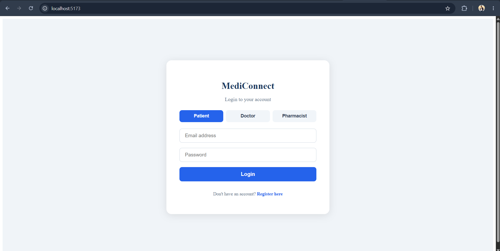
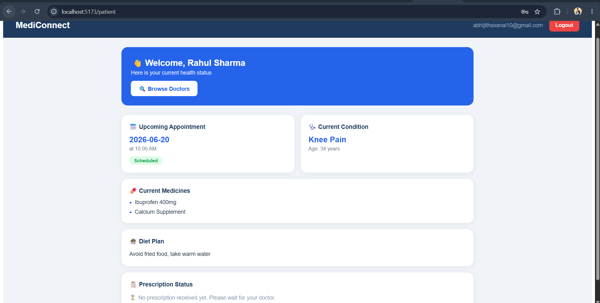
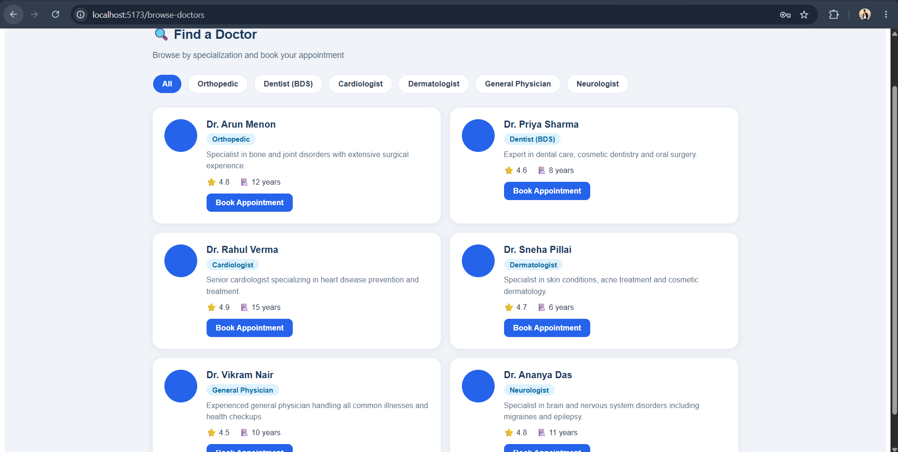
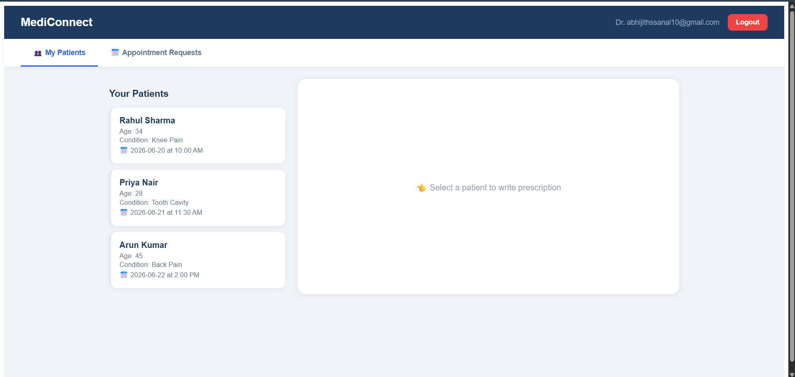
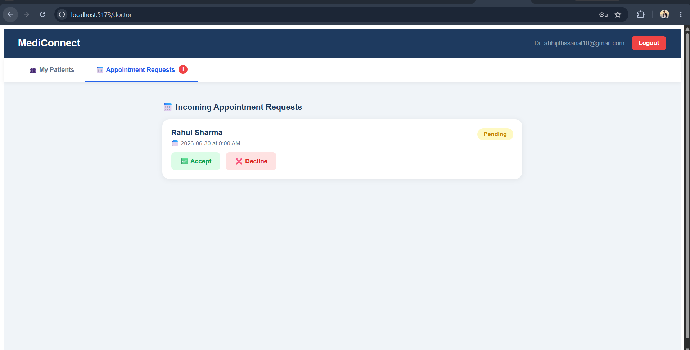
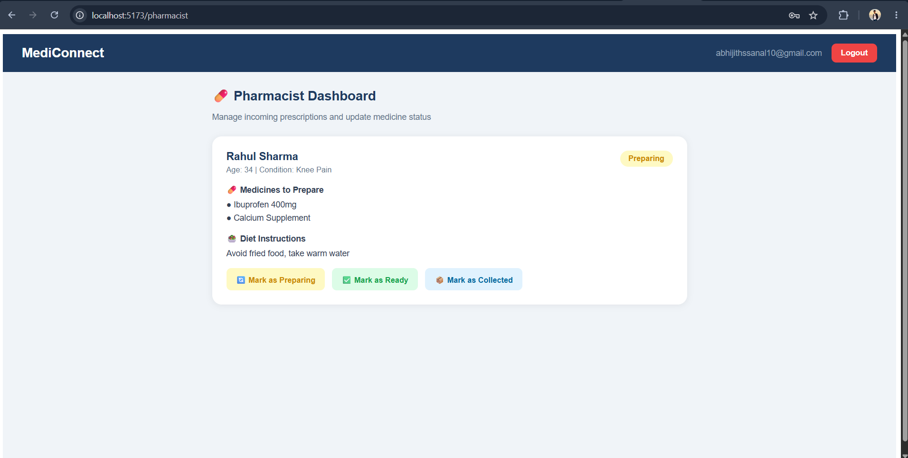

MediConnect is a frontend-focused Healthcare Management System designed to simulate real-world clinical workflows. The app supports three distinct user roles — Doctor, Patient, and Pharmacist — each with a dedicated dashboard and data flow, demonstrating how an end-to-end appointment-to-prescription-to-pharmacy pipeline would work in a digital health environment.

Built as a resume-showcase project, MediConnect highlights practical skills in React architecture, component design, client-side routing, and state management using the Context API.

 Features

## Doctor Dashboard
View and manage patient appointments
Create and issue prescriptions
Access patient medical history
Appointment status management (Confirm / Cancel / Complete)


## Patient Dashboard
Book appointments with available doctors
View upcoming and past appointments
Access issued prescriptions
Track prescription fulfillment status


## Pharmacist Dashboard
View incoming prescriptions
Mark prescriptions as fulfilled / dispensed
Track prescription queue and history


Authentication & Role-Based Access
Simulated login with role selection (Doctor / Patient / Pharmacist)
Protected routes — each role sees only their relevant dashboard
Persistent auth state via Context API


## 📂 Project Structure

```text
mediconnect/
├── public/
├── src/
│   ├── assets/
│   ├── components/         # Reusable UI components
│   │   ├── Navbar.jsx
│   │   ├── Sidebar.jsx
│   │   └── ProtectedRoute.jsx
│   ├── context/            # Global state via Context API
│   │   ├── AuthContext.jsx
│   │   └── DataContext.jsx
│   ├── pages/
│   │   ├── Login.jsx
│   │   ├── doctor/         # Doctor-specific pages
│   │   ├── patient/        # Patient-specific pages
│   │   └── pharmacist/     # Pharmacist-specific pages
│   ├── data/               # Mock data (appointments, prescriptions)
│   ├── App.jsx
│   └── main.jsx
├── index.html
├── vite.config.js
└── package.json
```

## 📸 Screenshots
### 🔐 Login Page




### 🏥 Patient Dashboard





### 🏥 Doctor Dashboard





### 🏥 Pharmacist Dashboard



